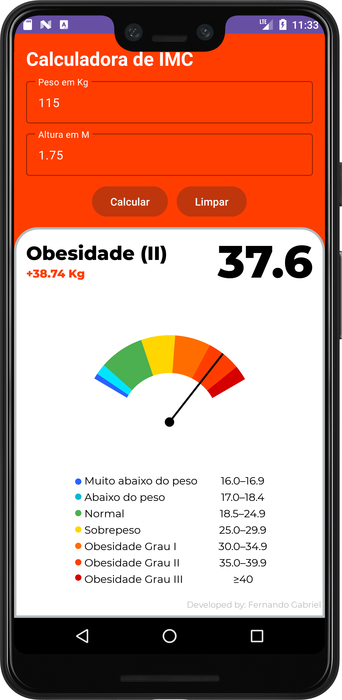

# Calculadora de IMC (Índice de Massa Corporal)

Este é meu primeiro aplicativo desenvolvido. A Calculadora de IMC é uma aplicação simples e intuitiva projetada para calcular o Índice de Massa Corporal de uma pessoa com base no peso e altura fornecidos.

## Funcionalidades:
- **Cálculo do IMC**: Permite ao usuário calcular seu IMC inserindo seu peso e altura.
- **Exibição do Resultado**: Exibe o índice calculado, indicando se o usuário está abaixo do peso, com peso normal, com sobrepeso ou obeso, conforme os padrões estabelecidos pela Organização Mundial da Saúde (OMS).

## Tecnologias Utilizadas:
- **Android Studio Koala | 2024.1.1**: IDE oficial para o desenvolvimento de aplicativos Android.
- **XML**: Utilizado para a criação da interface do usuário (layouts).
- **Java**: Linguagem de programação utilizada para a lógica de negócio do aplicativo.

## Capturas de Tela:

## Para utilizar:
1. Faça o download do código fonte.
2. Abra o projeto no Android Studio.
3. Compile e execute o aplicativo em um emulador Android ou dispositivo físico.

## Autor:
Fernando Gabriel - [GitHub](https://github.com/fernandogabrieu)
